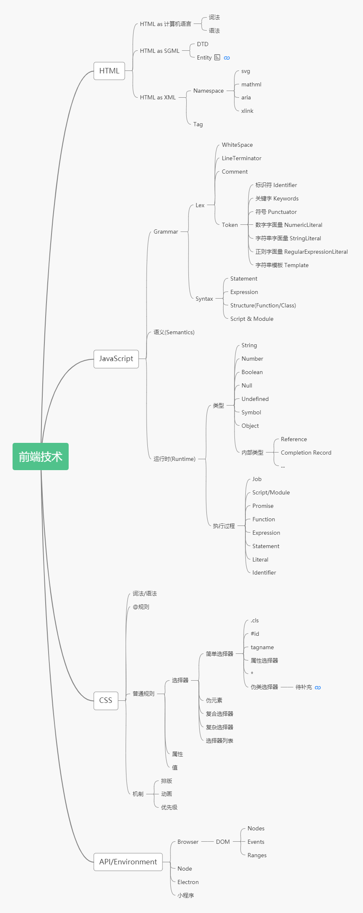

# 每周总结可以写在这里

本周的三节课主要是介绍前端的能力体系。然后对知识体系和工程体系进行了深入的分析。搭了一个知识体系和工程体系的框架。

# 前端的能力体系

前端的边界在哪儿，为什么我们不认为 hadoop 是前端能力的一部分

前端的能力体系包括三部分，最底下是三种能力

1. 编程能力
2. 架构能力
3. 工程能力

编程能力是写代码的能力，有时候跟算法有些接近，编程能力解决的是难写不出来的问题
架构能力解决的是大写不出来的问题，一个大的项目，可能每部分都会写，但是不是每部分写出来然后组合就能组成一个复杂的软件。这就是架构能力解决的问题
工程能力解决的是人与人之间协作的问题。个人认为，也是用于解决效率问题。

上一层是前端知识，前端知识包括前端所用到的语言，包括 js/css/html,所用到的 API。
三大框架是一种工程上的解决方案，框架本质上也是一种类库，只是和普通的类库看起来不一样。

再上一层是领域知识，这一部分跟特定的领域相关

# 前端能力如何提升

领域知识基本只能在工作时间中去积累，也没有太多必要特意去学，因为迁移能力不强，可能换一个领域之前的知识就没用了

前端知识的学习，要通过搭建知识体系。建立知识体系，然后对每个知识点深入学习。

编程能力的提升，需要刻意练习。刷题就是一种不错的方式

架构能力的提升，一方面实在工作中提升，另一方面主要靠阅读源码和参与开源项目

工程能力的提升，很难，基本只能靠选择合适的工作和在工作中争取。这部分个人感觉是非常重要的，想要提升基本只能靠工作中实践，但是这种机会不是想要就有的。所以要主动去争取。

# 学习方法

或者应该叫
知识体系的学习方法？

## 整理法

整理法就是要将通过知识之间的关系将知识整理成体系，知识之间的关系包括

1. 顺序关系。如编译包括词法分析、语法分析、代码优化、代码生成。这四步的关系是顺序关系
2. 组合关系。也可以叫包含关系。如 css 规则包含选择器、属性、值三部分。
3. 维度关系。从不同的维度去看同一个知识点。如 js 可以分为文法、语义、运行时三个维度去看。
4. 分类关系。如 css 简单选择器分为 id 选择器、类选择器、属性选择器等等。

## 追溯法

寻找概念、文章最早的提出人。概念、知识的变迁过程。

## 完备性

整理知识的时候，知识需要时完备的。比如编译包含四步，我们整理的只是就不能只有三步。
要做到完备性就只能寻找尽量权威的文章，如标准。

# 番外：面试

如何应对难题

## 题目类型

* 项目型问题
* 知识型问题
* 开放性问题
* 案例型问题
* 有趣的问题

项目型问题
主要是讲讲做过什么东西

知识型问题
可能会根据项目来问相关知识

开放性问题
尽量去答吧

案例型问题

# 前端知识体系

这块不太好描述，还是看图吧

# 前端工程体系

再刷一遍之后总结一下吧，这块是我要特别提升的点