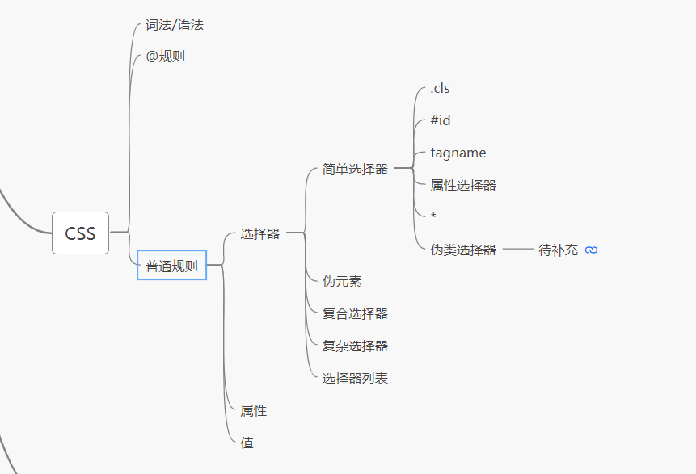

### 浏览器部分

在一个单独的项目中书写

https://github.com/baiyunshenghaishang/toy-browser

### css 脑图

第一课讲前端技术的时候就讲到了 css 的，从语法、规则和机制三个角度去讲的。最后落到规则和机制两个重点上。
这节课是从语法的角度讲，细分之后，其实都是不同的 css 规则。机制也只是一些属性的表现。
又稍微翻了下 css2.1 权威指南的目录，发现基本也是按照 css 规则的思路来组织的，选择器、值，然后重点是属性
所以 css 这边的脑图并没有重新画过，觉得之前第一节课的就挺好了，只是去掉了机制部分，觉得这块应该是属性的一部分，而不是独立的

